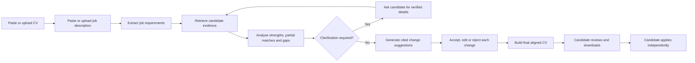
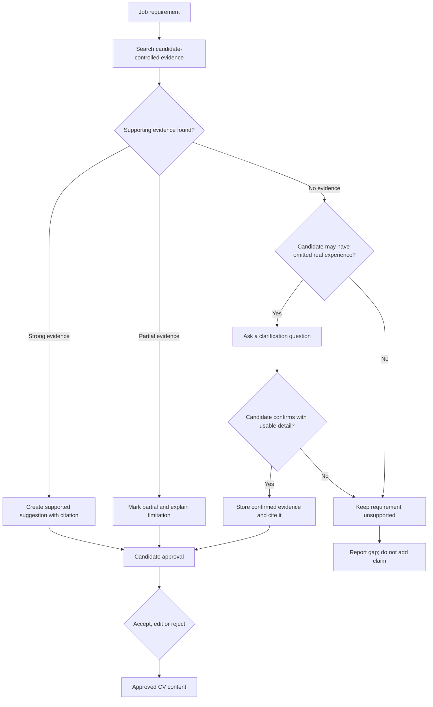
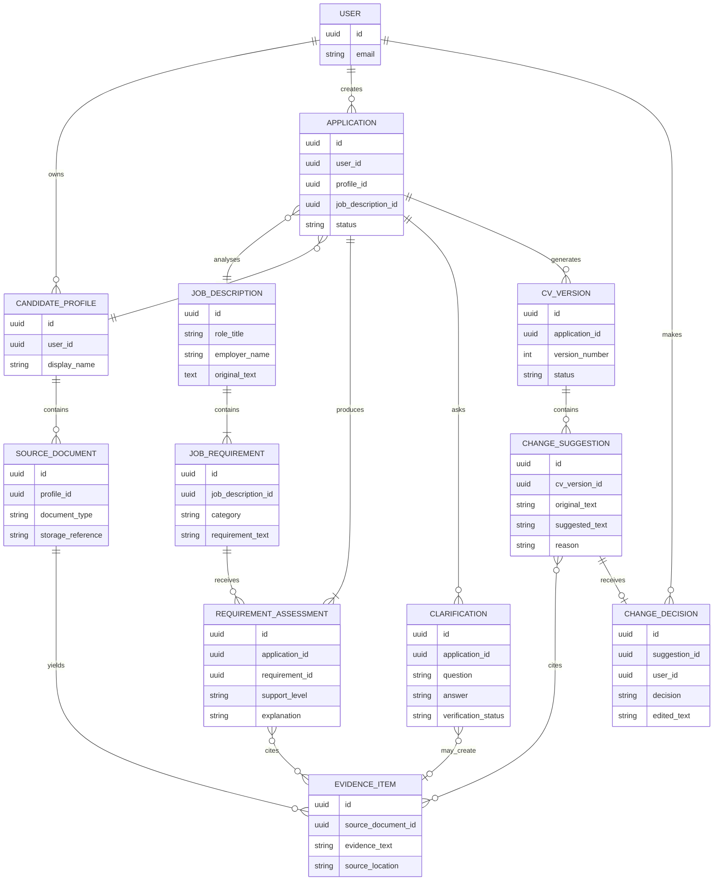
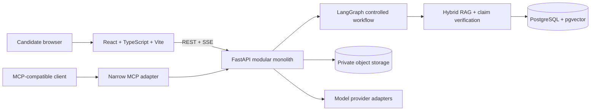

# GradPath AI

An evidence-grounded CV analysis and alignment platform for UK graduates and
early-career technology candidates.

## Status

GradPath AI is currently in the product-definition stage. No working product
features are claimed yet.

The first usable milestone will accept a fictional or redacted CV and a job
description, analyse the role's requirements against the candidate's evidence,
and produce a truthful, job-aligned CV for the user to review.

## The problem

Candidates often use generic AI tools to rewrite a CV without knowing:

- whether important claims are supported by their real experience;
- which job requirements are genuinely covered;
- which requirements need clarification or represent a real gap;
- what the AI changed and why;
- whether the final CV remains truthful and defensible in an interview.

GradPath AI treats CV alignment as an evidence and review problem, not simply a
text-generation problem.

## Product promise

Given a candidate's CV, optional supporting evidence, and a job description,
GradPath AI identifies strengths and gaps, maps requirements to cited evidence,
and produces a truthful, job-aligned CV with explainable changes for the
candidate to accept, edit, reject, and download.

The candidate always reviews the final CV and applies to the job themselves.

## Planned user journey



## Evidence and safety workflow

Every important generated claim must follow this path:



## Preliminary conceptual data model

This ERD captures the information the product is expected to manage. It is a
conceptual model, not a final database schema; Step 2 will validate entity
boundaries, privacy rules, identifiers, indexes, and retention.



## Project principles

1. Evidence before generation.
2. Never invent candidate experience.
3. Cite the source of important claims.
4. Explain significant changes.
5. Require human approval before finalising CV content.
6. Report uncertainty and genuine gaps.
7. Evaluate quality rather than relying on an impressive-looking demo.
8. Protect personal and confidential information.

## Planned outputs

- structured essential, desirable, and unclear job requirements;
- evidence coverage for each requirement;
- strengths, partial matches, genuine gaps, and clarification questions;
- a complete job-aligned CV;
- a change report containing original wording, suggested wording, reason,
  evidence citation, and confidence;
- unsupported-claim warnings;
- an approved CV that can eventually be exported as DOCX and PDF.

## Documentation

- [Product brief](docs/product-brief.md)
- [Product diagrams](docs/diagrams.md)
- [Technical architecture](docs/architecture.md)
- [Architecture decisions](docs/decisions/README.md)
- [Delivery roadmap](docs/roadmap.md)
- [Glossary](docs/glossary.md)

## Proposed technical architecture

GradPath AI uses a React/TypeScript web application and a FastAPI modular
monolith. The backend contains explicit ingestion, retrieval, verification,
alignment, export, and MCP adapter boundaries. PostgreSQL with pgvector stores
relational data and evidence vectors, while original uploads and exports remain
in private object storage.



The complete architecture document includes system context, container,
component, agent-state, RAG-sequence, security-boundary, deployment, and
physical ERD diagrams. All technology choices are explained through ADRs.

## Planned technical direction

The likely stack is React with TypeScript, Python, FastAPI, LangGraph,
PostgreSQL with pgvector, an MCP server, Docker, GitHub Actions, and Google
Cloud Run. These choices are provisional until Step 2 compares and validates
them against the requirements.

## Important data rule

Development and automated tests must use fictional, synthetic, or properly
redacted candidate data. Real CVs, personal contact details, and API keys must
never be committed.

## Repository structure

```text
gradpath-ai/
├── apps/
│   ├── api/                 # FastAPI modular monolith
│   ├── web/                 # React + TypeScript + Vite
│   └── mcp-server/          # permission-controlled MCP adapter
├── docs/
│   ├── decisions/           # architecture decision records
│   └── architecture.md      # technical design and diagrams
├── .github/workflows/       # continuous integration
├── compose.yaml             # local PostgreSQL + pgvector
├── pyproject.toml           # Python workspace and quality configuration
└── uv.lock                  # reproducible Python dependency lock
```

## Development setup

Prerequisites:

- Python 3.13
- Node.js 20.19 or a newer compatible release
- npm
- uv
- Docker with Compose when database work begins

Install locked dependencies:

```powershell
python -m uv sync --locked --all-packages --dev
npm ci --prefix apps/web
Copy-Item .env.example .env
```

Run the current API and web foundations in separate terminals:

```powershell
python -m uv run gradpath-api
npm --prefix apps/web run dev
```

Run all current checks:

```powershell
python -m uv run ruff format --check .
python -m uv run ruff check .
python -m uv run mypy
python -m uv run pytest
npm --prefix apps/web run check
```

The current scaffold intentionally does not perform CV analysis. Product
features begin with the evaluated vertical slice in Step 3.
