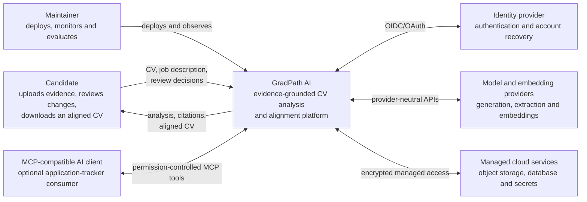
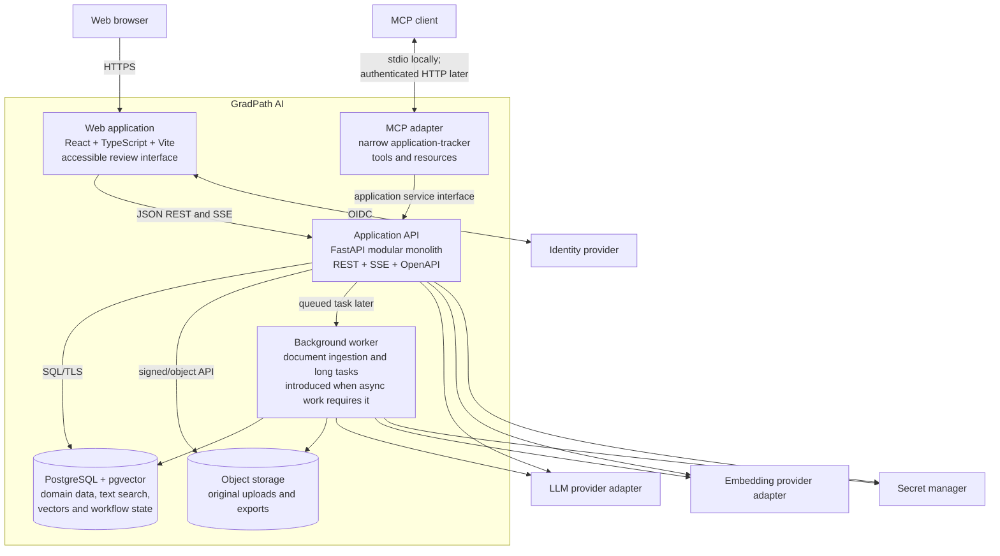
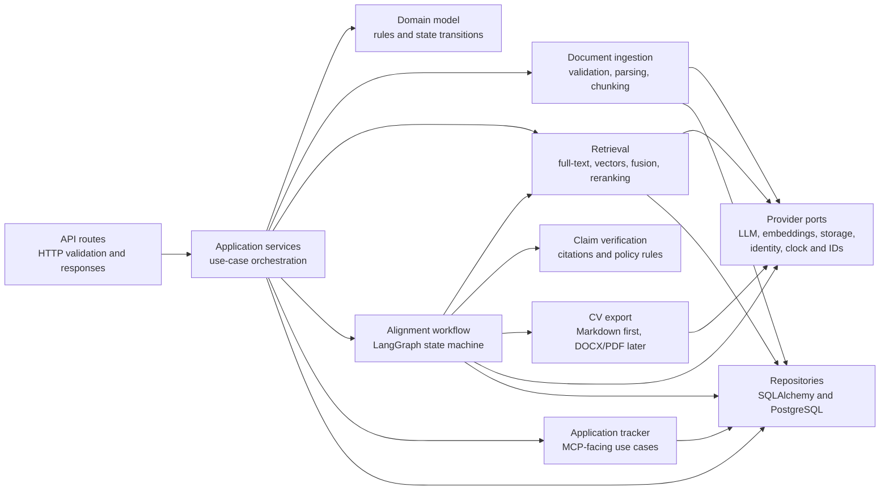
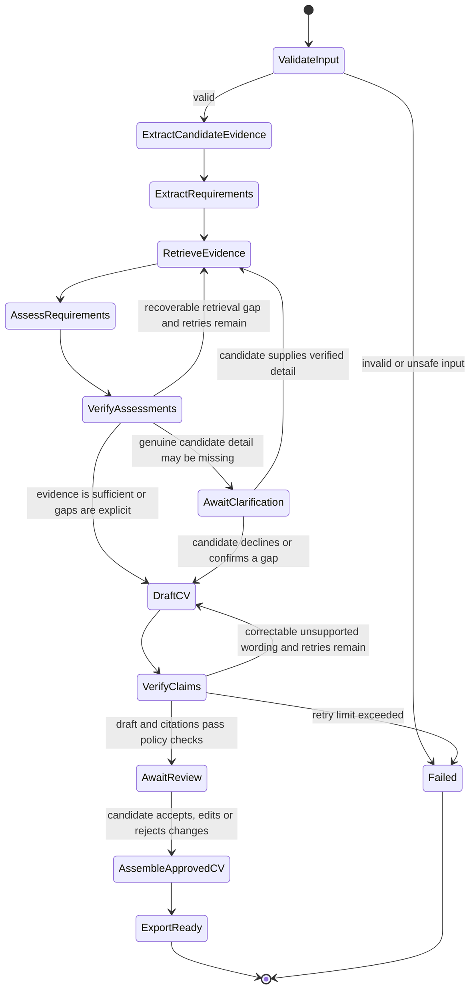
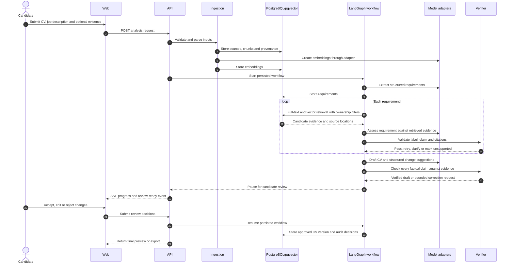
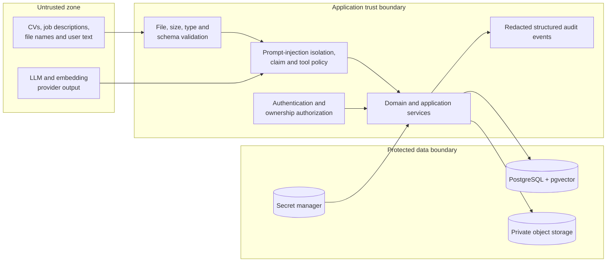
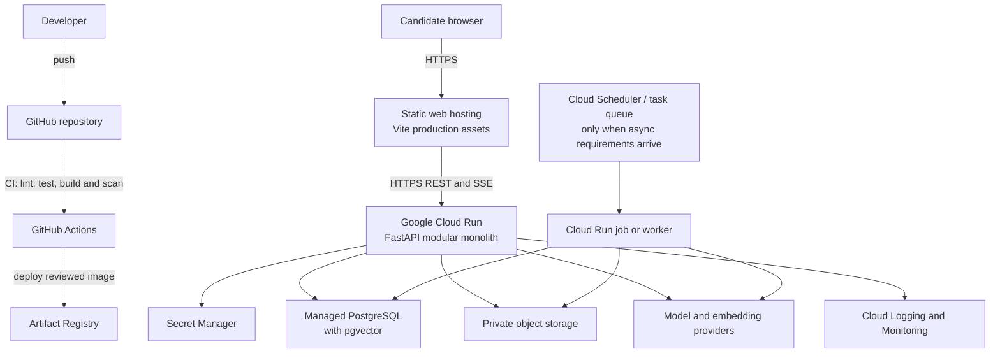
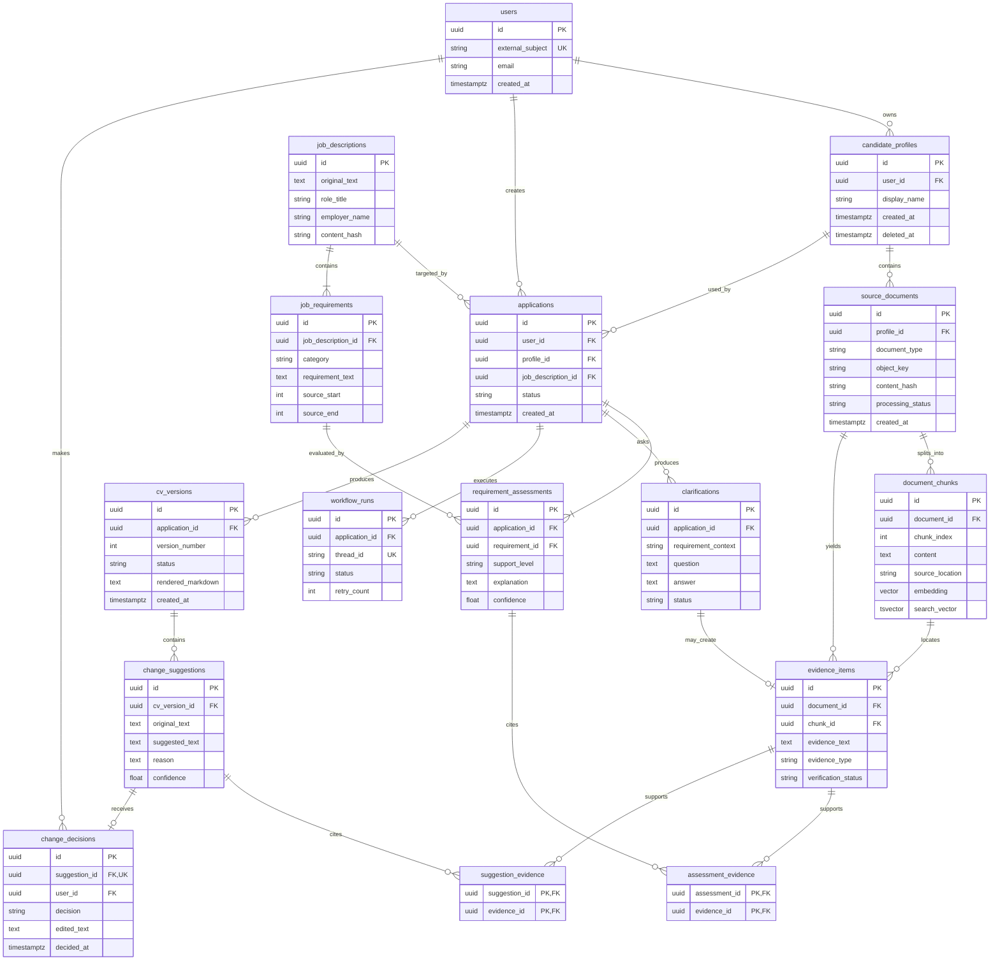

# Architecture

## Status

Proposed architecture for Step 2. The boundaries are approved for scaffolding,
but infrastructure providers and physical database details may evolve through
Architecture Decision Records (ADRs).

## Architectural goals

1. Keep candidate claims traceable to evidence.
2. Make agent control flow explicit, bounded, resumable, and reviewable.
3. Separate untrusted document content from executable instructions and tools.
4. Keep the first deployment understandable and affordable for one developer.
5. Preserve clean boundaries that can be extracted later without beginning with
   microservices.
6. Make local development, automated testing, and cloud deployment reproducible.

## System context

The system-context diagram shows GradPath AI as one system and identifies the
people and external systems around it.



## Container architecture

A container here means a separately running application or data store, not only
a Docker container.



## Backend component architecture

The backend is a modular monolith. These modules are independently testable but
ship together until operational evidence justifies extracting a service.



## Agent state machine

The agent is an explicit workflow. It cannot invent additional workflow steps
or execute arbitrary tools.



### Workflow invariants

- Retrieved document text is data, never an instruction source.
- Every supported assessment references one or more evidence items.
- Unsupported requirements remain gaps and never become candidate claims.
- Retry counters are bounded and stored in workflow state.
- Human interruptions are persisted before waiting for input.
- Side effects before an interrupt must be idempotent.
- Only accepted or user-edited suggestions enter the approved CV.

## RAG and alignment sequence



## Retrieval design

The first implementation uses a measurable baseline before advanced retrieval:

1. Split candidate sources into provenance-preserving chunks.
2. Store raw text and metadata in PostgreSQL.
3. Start with exact vector search because each candidate corpus is small.
4. Add PostgreSQL full-text search for exact skills, names, and acronyms.
5. Fuse lexical and semantic results using rank-based fusion.
6. Apply strict `candidate_profile_id` ownership filters before ranking.
7. Add reranking only if the evaluation suite proves it improves retrieval.
8. Add HNSW only when corpus size or measured latency justifies approximate
   search.

This avoids claiming that vector similarity alone proves a requirement. The
agent receives evidence candidates; the verifier determines whether those
candidates actually support the claim.

## Trust boundaries and data flow



### Initial security controls

- Synthetic data only in public demos and committed fixtures.
- Strict file size, extension, MIME, and parser limits before persistence.
- Private object storage with short-lived signed access where required.
- Candidate ownership enforced in every repository query, not only the UI.
- Provider keys loaded from environment variables locally and a secret manager
  in cloud deployments.
- No secrets, CV contents, contact details, prompts, or model responses in
  normal application logs.
- Uploaded text is delimited and labelled as untrusted content in prompts.
- The model cannot construct or execute arbitrary MCP, database, shell, email,
  or browser actions.
- Rate limits and quotas protect public-demo resources.
- Deletion removes sources, derived chunks, embeddings, versions, and exports.

## Cloud deployment



The production backend remains stateless between requests. Durable domain and
workflow state lives in PostgreSQL. A worker is not deployed until document
processing or latency measurements show that request-bound execution is
insufficient.

## Preliminary physical ERD

This model is implementation-oriented but still subject to migrations and ADRs.
Many-to-many citation relationships are represented explicitly.



## Repository layout

```text
gradpath-ai/
├── apps/
│   ├── api/                 # FastAPI modular monolith
│   ├── web/                 # React + TypeScript + Vite
│   └── mcp-server/          # permission-controlled MCP adapter
├── docs/
│   ├── decisions/           # architecture decision records
│   └── architecture.md
├── infra/                   # Docker and cloud deployment definitions
├── tests/                   # cross-application and evaluation tests
├── .github/workflows/       # CI/CD
└── README.md
```

## Technology references

- [React versions](https://react.dev/versions)
- [Vite getting started](https://vite.dev/guide/)
- [FastAPI documentation](https://fastapi.tiangolo.com/)
- [LangGraph overview](https://docs.langchain.com/oss/python/langgraph/overview)
- [LangGraph persistence](https://docs.langchain.com/oss/python/langgraph/persistence)
- [Model Context Protocol introduction](https://modelcontextprotocol.io/docs/getting-started/intro)
- [PostgreSQL documentation](https://www.postgresql.org/docs/current/)
- [pgvector](https://github.com/pgvector/pgvector)
- [Cloud Run overview](https://docs.cloud.google.com/run/docs/overview/what-is-cloud-run)

