# Step 3: Evaluated Text-Analysis Vertical Slice

## Outcome

Step 3 proves the smallest path through the real application boundaries before
file uploads, accounts, vector storage, or a full user interface are added.

```mermaid
flowchart LR
    Request["POST /api/v1/analyses"] --> Extract["Deterministic requirement extraction"]
    Extract --> Chunk["Candidate source catalog"]
    Chunk --> Retrieve["Transparent lexical retrieval"]
    Retrieve --> Provider["Replaceable analysis provider"]
    Provider --> Schema["Pydantic Structured Output"]
    Schema --> Verify["Independent citation verification"]
    Verify --> Response["Match report + changes + Markdown CV"]
```

## Why the pipeline is split

The model is useful for semantic assessment and rewriting, but it does not own
the source of truth. Application code extracts stable requirements, assigns
candidate source IDs, performs a reproducible retrieval baseline, and verifies
the returned citations. This makes failures observable and allows later RAG
approaches to be compared with the lexical baseline.

## API contract

`POST /api/v1/analyses` accepts:

- `candidate_cv`: pasted fictional or redacted CV text;
- `job_description`: pasted vacancy text with explicit requirement lists;
- `supporting_evidence`: optional candidate-controlled text.

The response includes:

- essential, desirable, and unclear requirements;
- supported, partially supported, unsupported, or uncertain assessments;
- exact quotes linked to stable source IDs;
- strengths and genuine gaps;
- cited change suggestions and confidence;
- unsupported-claim warnings;
- a complete Markdown CV draft;
- `review_required: true`.

## Safety checks

The application rejects a provider result when:

- the provider changes, removes, or adds application-extracted requirements;
- a citation references an unknown source ID;
- a citation labels the wrong source type;
- quoted evidence is not present in the cited candidate source;
- a supported assessment has no citation;
- added, expanded, or rewritten wording has no citation.

Job-description text is never placed in the candidate evidence catalog.
Provider errors expose a generic API response and do not log CV contents.
OpenAI response storage is disabled by default.

## Evaluation case

`graduate-fullstack-001` is entirely fictional. It contains 11 requirements and
tests supported full-stack skills alongside deliberately unsupported AWS and
Kubernetes requirements. The checked-in answer key defines expected coverage,
required gaps, prohibited claims, change decisions, and preserved CV facts.

The deterministic end-to-end test crosses the HTTP, extraction, retrieval,
provider, validation, and output boundaries without network access.

## Model integration

The real adapter uses the OpenAI Responses API and native Pydantic Structured
Outputs. Its model, reasoning effort, and storage setting are configuration,
not hard-coded business logic. Automated tests inject a deterministic provider.

The first live request on 27 July 2026 reached OpenAI but returned HTTP 429 with
`insufficient_quota`. This confirms key loading and network connectivity but
does not count as a successful model validation. A live golden-case run remains
pending until API credits or project quota are available.

## Deliberate limitations

- Requirement extraction currently expects numbered or bulleted lists.
- Retrieval is a lexical baseline, not embedding or hybrid RAG.
- Markdown source chunking is intentionally narrow.
- No file parsing, persistence, authentication, review UI, or export exists.
- A generated CV remains a draft until the candidate reviews it.

These limitations define the starting point for the RAG and agentic-workflow
stages rather than being hidden behind a polished demo.
