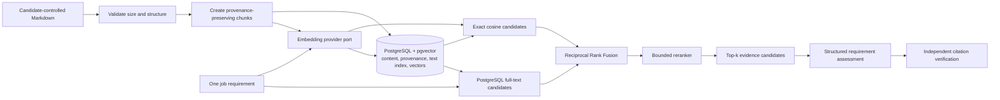

# Step 4 — RAG Foundation

## Objective

Replace the Step 3 token-overlap retriever with a measured, provenance-safe
hybrid retrieval pipeline. The stage succeeds only if retrieval quality is
reported against committed fictional evaluation data.

## Why hybrid retrieval

Lexical search is strong when a requirement and source share exact terms such
as `React`, `SQL`, or `Docker`. Dense embeddings are strong when the meaning is
similar but the wording differs, such as `CI/CD workflows` and `GitHub Actions`.
Neither score proves that a candidate has a skill, so GradPath retrieves
candidate evidence and retains independent citation and policy validation.

The Step 3 lexical baseline on `graduate-fullstack-001` is:

| Metric | Baseline at 3 |
|---|---:|
| Hit Rate | 0.6000 |
| Recall | 0.4444 |
| Mean Reciprocal Rank | 0.6000 |

These values are frozen as the starting benchmark. A permanent evaluation
runner will recompute them rather than trusting this table alone.

## Pipeline



## Ingestion contract

1. Only candidate-controlled CV and supporting-evidence text becomes candidate
   evidence. Job-description text remains a query source, never proof.
2. Inputs are size-limited before parsing and embedding.
3. Chunk IDs are deterministic within a source and preserve source kind,
   heading, order, and exact citable text.
4. Empty chunks, duplicate IDs, and unexpectedly large chunks are rejected.
5. Embeddings are created in bounded batches.
6. The embedding model and dimension are stored with each vector set.
7. Source deletion cascades to chunks, embeddings, and text-search data.

Step 4 accepts pasted Markdown. Safe PDF and DOCX parsing is introduced with
the upload workflow after parser-specific file, MIME, archive, and resource
limits can be enforced; converting arbitrary uploaded files is not hidden inside
this retrieval change.

## Retrieval and fusion

For every job requirement:

1. retrieve the top lexical candidates;
2. retrieve the top semantic candidates using cosine similarity;
3. fuse their ranks with `1 / (k + rank)`, using a documented constant `k`;
4. rerank only a bounded candidate set;
5. return the top evidence chunks with component ranks and scores for debugging;
6. pass the exact original chunk text to the analysis provider.

RRF is used because PostgreSQL text rank and cosine similarity are not
calibrated probabilities and should not be added directly.

## Evaluation contract

Committed evaluation cases define relevant evidence IDs for each requirement.
The runner reports each retrieval variant independently:

- Hit Rate@k: fraction of queries with at least one relevant result;
- Recall@k: fraction of expected evidence chunks retrieved;
- Mean Reciprocal Rank: how early the first relevant result appears;
- unsupported-query diagnostics: retrieved negative or irrelevant evidence;
- latency and embedding-token usage for live runs when available.

Scores are reported for lexical, semantic, fused, and reranked retrieval. A
method is not described as an improvement unless the committed report supports
that statement.

## Security and privacy

- Document text and embedding output are untrusted data.
- Normal logs contain identifiers and timings, not CV text or vectors.
- Repository queries enforce candidate or analysis ownership before ranking.
- Provider keys remain in ignored local configuration or managed secrets.
- OpenAI embedding requests use the existing project key; no secret is stored
  with evaluation output.
- Embeddings are personal-data derivatives and follow the source deletion
  lifecycle.

## Measured result — 30 July 2026

The permanent evaluator ran the first fictional golden case through three
variants at `k=3`:

| Variant | Hit Rate@3 | Recall@3 | MRR |
|---|---:|---:|---:|
| Step 3 lexical baseline | 0.6000 | 0.4444 | 0.6000 |
| PostgreSQL hybrid + RRF | 0.9000 | 0.6667 | 0.7333 |
| Hybrid + evidence-aware reranker | **1.0000** | **0.8333** | **0.8167** |

The final variant retrieved 15 of 18 expected evidence chunks and found at
least one expected chunk for all ten evaluated queries. Its OpenAI embedding
request used 568 input tokens. At the documented $0.02 per million-token price
for `text-embedding-3-small`, the estimated embedding cost was $0.00001136.

PostgreSQL 18 with pgvector 0.8.5 performed exact cosine retrieval alongside a
generated full-text vector. The post-run database check returned zero retained
retrieval rows.

The first complete live analysis after enabling hybrid retrieval exposed a
status regression: richer evidence caused one low-threshold requirement to be
labelled partially supported. The assessment policy was clarified so explicit
negative or reading-only evidence cannot imply practical experience, an `or`
requirement is satisfied by one documented alternative, and direct hands-on
use is sufficient when the employer asks only for familiarity or exposure. The
corrected live run matched all 11 expected statuses, returned 33 independently
validated citations and 4 evidence-backed changes, and produced the aligned CV.
This is an example of evaluation changing the implementation rather than merely
reporting a flattering retrieval score.

The detailed machine-readable result is stored in
[`evals/results/step-4-rag-2026-07-30.json`](../evals/results/step-4-rag-2026-07-30.json).
The current report covers one deep fictional case, so it demonstrates a measured
improvement on this dataset rather than universal retrieval superiority.

Reproduction commands:

```powershell
python -m uv run --package gradpath-api python scripts/evaluate_retrieval.py --mode lexical
python -m uv run alembic upgrade head
python -m uv run --package gradpath-api python scripts/evaluate_retrieval.py --mode hybrid --postgres
python -m uv run --package gradpath-api python scripts/evaluate_retrieval.py --mode hybrid --postgres --rerank
```

References: [OpenAI embeddings](https://developers.openai.com/api/docs/guides/embeddings#how-to-get-embeddings),
[OpenAI API pricing](https://developers.openai.com/api/docs/pricing),
[pgvector hybrid search](https://github.com/pgvector/pgvector#hybrid-search),
and [PostgreSQL text ranking](https://www.postgresql.org/docs/current/textsearch-controls.html#TEXTSEARCH-RANKING).

## Exit criteria

- deterministic tests cover chunking, batching, dimensions, fusion, reranking,
  provenance, deletion boundaries, and provider failure;
- PostgreSQL integration tests exercise `pgvector` and full-text retrieval;
- the permanent evaluation runner compares retrieval variants;
- one controlled live embedding run succeeds on fictional data;
- diagrams, ADRs, commands, results, costs, and limitations are documented;
- CI and the production API image pass before the draft pull request is opened.
