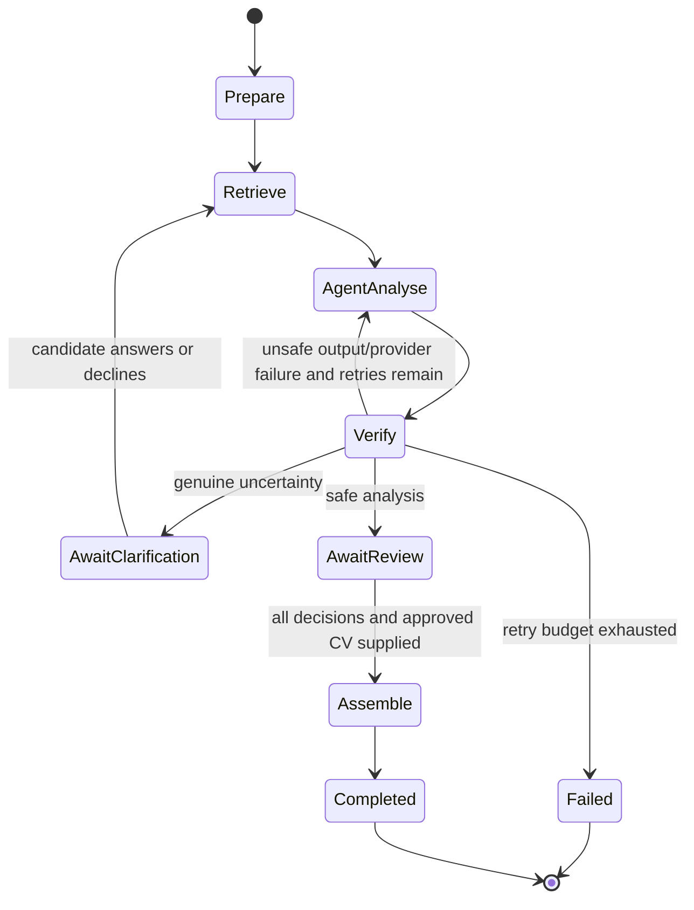

# Step 5: Agentic workflow

## Outcome

Step 5 turns the single-call analysis slice into an explicit, resumable
workflow. It can pause for candidate clarification, retry unsafe or failed
model output within a fixed budget, wait for human review, and complete only
with the exact CV text approved by the candidate.

## Why this is agentic

“Agentic” does not mean allowing a model to do anything it wants. Here it means
the system can pursue a bounded goal across several steps, use retrieved
context, respond to verification results, pause for human input, resume from
state, and stop predictably.

LangGraph is the control plane. One OpenAI Agents SDK specialist performs the
model judgement. Deterministic Python code controls evidence retrieval,
validation, retries, and approval.

## Workflow contract

Input:

- candidate CV text;
- job-description text;
- optional candidate-controlled supporting evidence.

Possible terminal or pause states:

- `awaiting_clarification`: a genuine ambiguity has a requirement-specific
  question;
- `awaiting_review`: analysis and citations passed validation, but the draft is
  not approved;
- `failed`: provider or validation failures exceeded the retry budget;
- `completed`: the candidate submitted every decision and approved CV text.

## State machine



## Trust boundaries

- Documents and model output are untrusted data.
- The agent has no function tools, MCP access, shell, browser, or database
  access.
- Retrieved source identifiers and exact quotes are verified independently.
- Supported and partially supported assessments require citations.
- Added, expanded, and rewritten CV wording requires citations.
- The workflow cannot silently finalise a draft.
- Tracing is disabled by default and excludes sensitive trace content when
  deliberately enabled on synthetic data.

## API lifecycle

- `POST /api/v1/workflows` starts a workflow.
- `GET /api/v1/workflows/{workflow_id}` reads its safe snapshot.
- `POST /api/v1/workflows/{workflow_id}/clarifications` resumes uncertainty.
- `POST /api/v1/workflows/{workflow_id}/review` applies human decisions.

## Evaluation matrix

| Scenario | Expected behaviour |
| --- | --- |
| Safe supported/unsupported analysis | Pause at review; never auto-approve |
| Ambiguous candidate evidence | Pause with a requirement-specific question |
| Candidate clarification | Rebuild evidence and reassess |
| Fabricated citation | Reject output and retry within budget |
| Provider failure | Retry a fixed number of times, then fail safely |
| Prompt injection in a CV | Treat it as text; never turn it into a claim |
| Incomplete review | Return a conflict; remain paused |

Tests exercise the real LangGraph path with deterministic providers, so they
verify routing and state without spending API credit or asserting volatile
model prose.

## Current limitation

`InMemoryWorkflowRepository` loses paused workflows when the API process
restarts and cannot support multiple replicas. The repository interface is
deliberate: production work will replace it with PostgreSQL persistence without
changing the domain or HTTP contracts.

## Local verification

```powershell
python -m uv run pytest apps/api/tests/test_alignment_workflow.py `
  apps/api/tests/test_workflow_api.py
python -m uv run ruff format --check .
python -m uv run ruff check .
python -m uv run mypy
```
