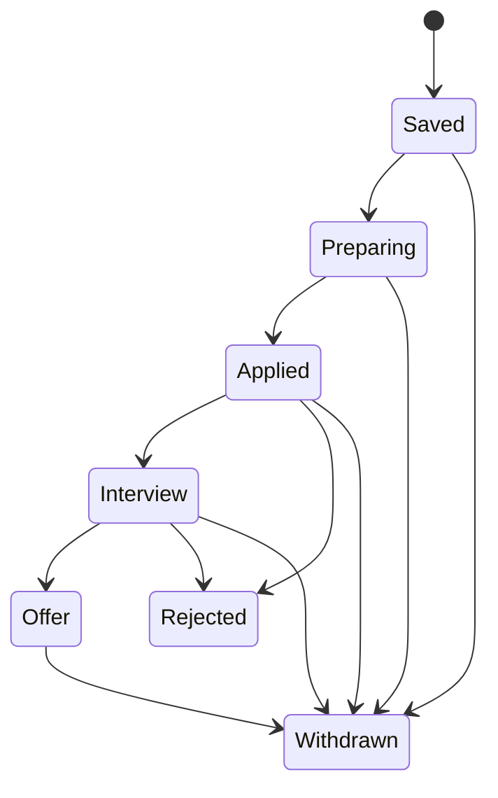
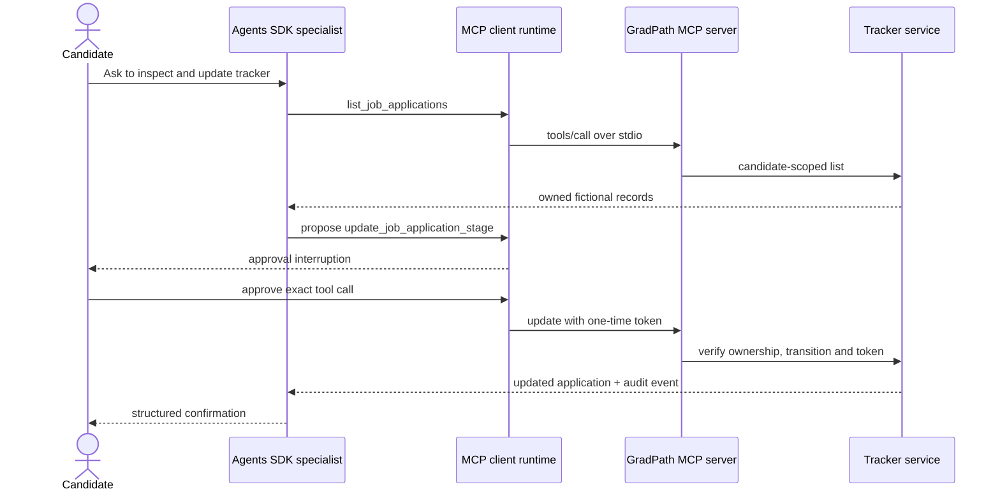

# Step 6: MCP integration

## Outcome

GradPath AI now exposes an original job-application tracker through Model
Context Protocol (MCP). An Agents SDK specialist can read fictional records and
update a lifecycle stage only after a real approval pause and server-side token
validation.

MCP is an interoperability boundary, not GradPath AI's internal architecture.
The shared `ApplicationTrackerService` owns authorization and transitions; the
MCP server translates protocol calls into that service.

## Capability surface

| Capability | Type | Permission |
| --- | --- | --- |
| `list_job_applications` | Tool | Candidate-scoped, read-only |
| `get_job_application` | Tool | Candidate-scoped, read-only |
| `update_job_application_stage` | Tool | Candidate-scoped, approval-gated write |
| `gradpath://applications` | Resource | Safe aggregate summary |
| `gradpath://applications/{id}` | Resource | Candidate-owned record |

The server deliberately does not expose applying to jobs, contacting
employers, deleting records, arbitrary SQL, URLs, file access, CV bodies, or
other candidates' data.

## Permission model

Every repository read includes `candidate_profile_id`. A record owned by
another profile is indistinguishable from a missing record, preventing
cross-profile existence leaks.

A stage update needs a token created outside the model loop. That token is:

- at least 32 characters;
- short-lived;
- single-use;
- bound to the candidate profile;
- bound to the application;
- bound to the current and target stages.

The Agents SDK also pauses before calling the MCP write tool. Approving the SDK
interruption permits the tool call; it does not bypass the server token.

## Allowed lifecycle



Backward transitions such as `applied` to `saved` are rejected. Repeating the
current stage is permitted only with a valid approval, making a retry safe but
still authorized.

## Agent-to-MCP sequence



## Running locally

Start the stdio server for an MCP client:

```powershell
python -m uv run gradpath-mcp
```

Run the synthetic live Agents SDK integration:

```powershell
python -m uv run python scripts/smoke_mcp_agent.py
```

The smoke harness generates an ephemeral fictional approval token in memory.
It is supplied only to the local child server and the model tool loop, is not
committed, and is excluded from the printed evaluation result.

## Verification matrix

| Scenario | Expected result |
| --- | --- |
| List records | Only authenticated profile records returned |
| Cross-profile lookup | Generic not-found error |
| Read metadata | MCP annotations identify read-only tools |
| Backward transition | Rejected before mutation |
| Wrongly bound token | Rejected and invalidated |
| Expired token | Rejected |
| Replayed token | Rejected |
| Agent write | Pauses once, then succeeds only after approval |

## Current limitations

- The fictional in-memory repository resets with the MCP process.
- Stdio is local; remote HTTP authentication is deliberately deferred.
- Approval state is in memory and should move to a durable, audited store for
  production.
- The Step 6 agent integration is a synthetic evaluation, not permission to
  update real job applications.

## Official guidance followed

- [Agents SDK integrations and observability](https://developers.openai.com/api/docs/guides/agents/integrations-observability)
- [MCP and connectors safety guidance](https://developers.openai.com/api/docs/guides/tools-connectors-mcp)
