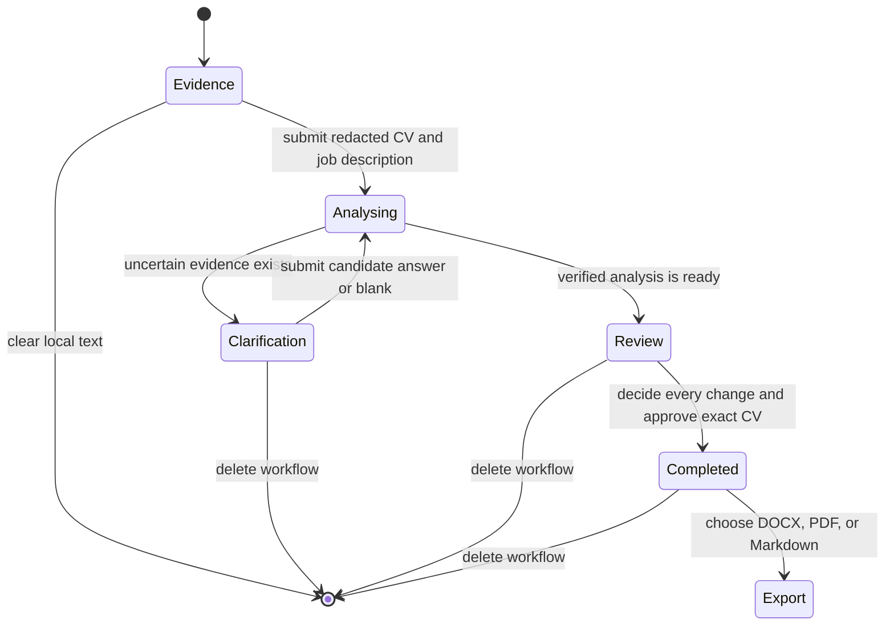
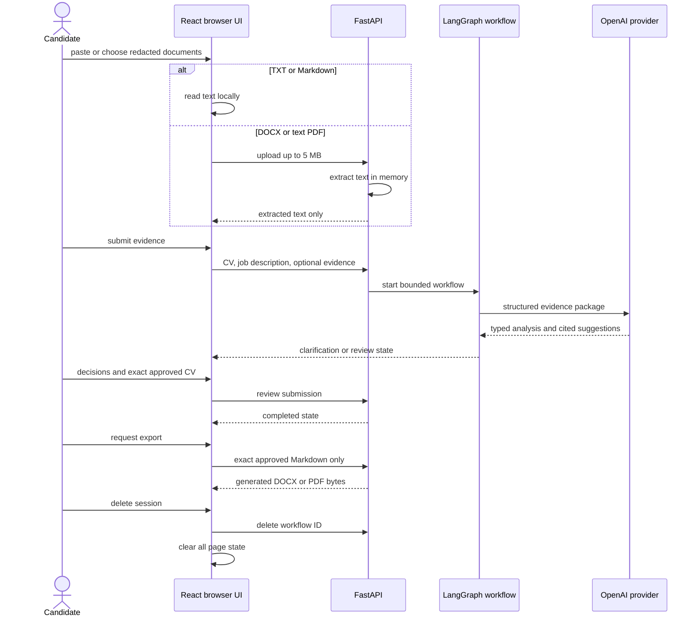

# Step 7: Candidate-controlled product interface

## Outcome

Step 7 turns the tested backend workflow into a usable responsive product. A
candidate can complete the core alignment journey without a terminal:

1. paste text or upload a TXT, Markdown, DOCX, or text-based PDF CV;
2. provide the job description and optional supporting evidence;
3. inspect requirement coverage, rationale, and exact candidate citations;
4. answer clarification questions without being forced to invent evidence;
5. accept, edit, or reject every proposed change;
6. inspect and approve the exact final Markdown CV;
7. download an editable DOCX, fixed-layout PDF, or Markdown source; and
8. delete the active workflow and clear browser state.

## Product-state diagram

## Data lifecycle and trust boundary

## API additions

| Endpoint | Purpose | Persistence |
|---|---|---|
| `POST /api/v1/documents/extract` | Extract selectable text from an allow-listed document of at most 5 MB | None |
| `POST /api/v1/documents/export/docx` | Format the exact approved Markdown as an editable, single-column A4 CV | None |
| `POST /api/v1/documents/export/pdf` | Format the exact approved Markdown as a fixed-layout A4 CV | None |
| `DELETE /api/v1/workflows/{id}` | Remove the active workflow snapshot | Deletes process-local state |

Files are identified by an extension allow-list, parsed in memory, and never
written by the extraction endpoint. Encrypted PDFs, damaged files, scanned
image-only PDFs, unsupported extensions, empty files, and files over 5 MB are
rejected with candidate-readable errors.

## Export design

The export uses the `google_docs_default` document preset as its accessibility
and interoperability base, with named CV-specific overrides: A4 rather than US
Letter for UK applications, 16/18 mm margins, compact 10 pt Arial body text,
dark-green section headings, and a bold centred name. Both formats are
single-column and avoid tables, icons, charts, headers, and text boxes so
applicant-tracking systems can read content in a predictable order.

DOCX remains editable. PDF provides a stable application preview. Markdown is
the neutral source representation. Export never calls the AI provider and
therefore cannot change approved wording.

## Verification evidence

- Python: Ruff format/lint, strict MyPy, and 44 passing tests (one existing
  opt-in PostgreSQL integration test skipped).
- Web: Prettier, Oxlint, three Vitest/Testing Library tests, TypeScript build,
  and Vite production build.
- Export: a fictional CV was rendered from DOCX through Microsoft Word and
  directly from PDF through Poppler. Every page was inspected after correcting
  Markdown subheadings and an orphan-heading page break.
- Browser: desktop at 1440 x 1000 and mobile at 390 x 844; no horizontal
  overflow, missing form labels, console warnings, or console errors.

The fixture generator is `scripts/generate_step7_export_fixture.py`. Generated
QA documents and page images remain under the ignored `tmp/` directory.

## Honest current limitations

- Workflow persistence is process-local. Restarting the API loses active
  workflows; Step 8/9 must add production persistence and retention controls.
- The first release extracts selectable PDF text but does not perform OCR.
- Markdown support intentionally covers CV-oriented headings, paragraphs, and
  bullets rather than arbitrary Markdown.
- The interface asks candidates to redact direct identifiers, but automatic
  redaction and authentication remain Step 8 work.
- The UI does not submit job applications. The candidate downloads, verifies,
  and applies independently.
