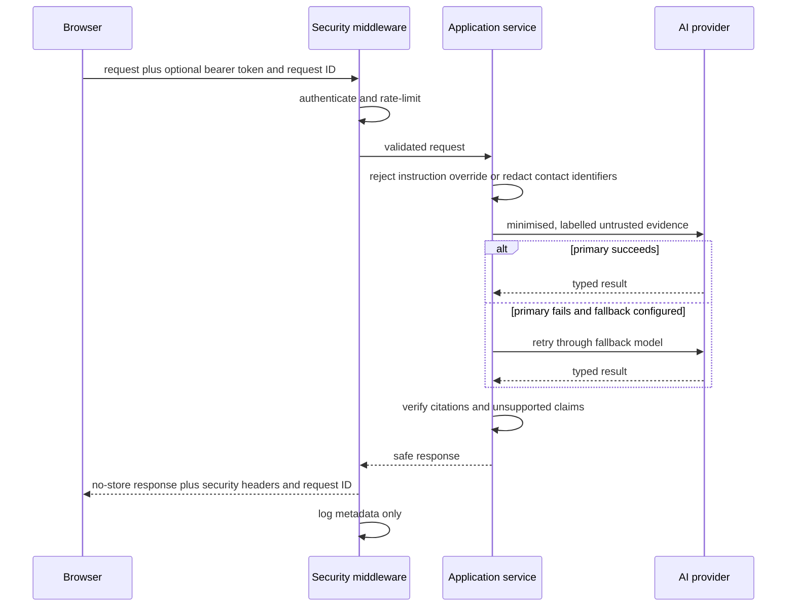

# Step 8: Security, privacy, and reliability

## Outcome

Step 8 turns the Step 7 local product into a defensible public-demo candidate.
It does not claim production security prematurely. It adds layered controls at
the HTTP, application, AI-provider, and user-interface boundaries and records
the remaining deployment work explicitly.

## Threat model

The assets requiring protection are candidate CV text, contact identifiers,
job-search evidence, workflow decisions, API credit, provider credentials, and
the integrity of generated claims.

| Threat | Example | Control | Remaining limitation |
|---|---|---|---|
| Spoofing | Unauthorised visitor consumes paid AI requests | Optional constant-time bearer-token check | Shared token is demo access, not personal identity |
| Tampering | Uploaded CV instructs the model to invent experience | Deterministic high-confidence detection, untrusted-data prompt delimiters, typed output and citation verification | Detection cannot identify every possible adversarial phrase |
| Repudiation | User reports a failed request with no trace | Caller-supplied or generated request ID in response and JSON log | No durable log sink until cloud deployment |
| Information disclosure | Validation errors or logs reveal CV text | Body-free structured logs, safe validation handler, no-store responses, direct-contact redaction | Names and non-contact personal details are not automatically removed |
| Denial of service | Repeated export or analysis requests exhaust capacity or credit | Per-client, per-method, per-path sliding-window throttle | In-memory counters do not coordinate across multiple instances |
| Elevation of privilege | Proxy header spoofing bypasses client limits | Forwarded headers ignored unless explicitly trusted | Cloud proxy trust must be configured carefully in Step 9 |
| Provider outage | Primary model is temporarily unavailable | Optional ordered fallback model plus existing bounded workflow retry | A full provider outage still returns a safe failure |

## Trust-boundary diagram

```mermaid
flowchart LR
    Candidate["Candidate browser"] -->|"Bearer token when configured"| HTTP["HTTP security boundary"]
    Attacker["Untrusted visitor or document"] --> HTTP
    HTTP --> Auth{"Access token valid?"}
    Auth -- "No" --> Reject401["401 without secret detail"]
    Auth -- "Yes or local mode" --> Limit{"Within rate limit?"}
    Limit -- "No" --> Reject429["429 plus Retry-After"]
    Limit -- "Yes" --> Validate["Typed request validation without input echo"]
    Validate --> Inspect["Prompt-injection inspection"]
    Inspect -->|"High-confidence override phrase"| Reject422["422 before provider use"]
    Inspect --> Redact["Email, phone and UK postcode redaction"]
    Redact --> Primary["Primary analysis model"]
    Primary -->|"Provider failure"| Fallback["Optional fallback model"]
    Primary --> Verify["Schema, citation and claim validation"]
    Fallback --> Verify
    Verify --> Review["Candidate review and exact-text approval"]
    HTTP --> Logs["Request ID, path, status and timing only"]
```

## Request lifecycle

## Implemented controls

### Safe demo access

`GRADPATH_DEMO_ACCESS_TOKEN` is optional for local development and required by
deployment policy before exposing paid endpoints publicly. When configured,
all API operations except liveness, readiness, and safe metadata require
`Authorization: Bearer <token>`. The React interface keeps the token only in
component/module memory and does not use local storage, session storage, URLs,
or cookies.

This is deliberately described as demo access control rather than user
authentication. Personal accounts, recovery, ownership persistence, and
multi-user authorisation require a real identity provider in a later release.

### Personal-data minimisation

Before retrieval embeddings or model analysis, the application replaces email
addresses, UK-style telephone numbers, and UK postcodes with explicit
placeholders. Only redaction counts are returned to the browser. Detected values
are never placed in logs. Candidates are told to restore verified contact
details during the exact-text final review.

### Prompt-injection defence

The application rejects high-confidence override and system-prompt extraction
phrases before provider use. Accepted document text remains labelled as
untrusted data in the agent prompt. The model has no tools during CV analysis,
and every positive claim still needs an exact candidate-source citation that
passes deterministic validation.

### Availability and failure handling

The middleware implements a one-process sliding-window limiter. Production
readiness returns HTTP 503 when the analysis workflow has no configured
provider. `GRADPATH_OPENAI_FALLBACK_MODEL` can configure a second model after a
primary provider failure. The fallback receives the same minimised context and
cannot bypass output verification.

### Browser and response hardening

Every response uses `Cache-Control: no-store`, `X-Content-Type-Options:
nosniff`, `X-Frame-Options: DENY`, `Referrer-Policy: no-referrer`, and a
restrictive `Permissions-Policy`. Every response also returns `X-Request-ID`.
Validation errors report locations and messages without echoing invalid input.

## Verification

Automated tests cover:

- contact identifier redaction without value leakage;
- high-confidence prompt injection rejected before provider invocation;
- demo-token denial and success paths;
- public health endpoints;
- rate-limit response and `Retry-After`;
- security and no-store response headers;
- safe request IDs;
- validation errors that do not echo sensitive values;
- production readiness without a provider; and
- primary provider failure followed by successful fallback.

The existing evidence, workflow, MCP, document, export, and UI tests remain in
the regression suite.

## Honest limitations and Step 9 requirements

- Replace the shared demo token with real authentication and per-record
  ownership before storing multiple users' data.
- Replace in-memory workflow state and rate limits with durable, expiring,
  multi-instance stores.
- Configure an explicit retention period, deletion job, encrypted managed
  database, and private object storage before persisting documents.
- Put the service behind a trusted HTTPS proxy, configure allowed hosts and
  exact CORS origins, and enable proxy-header trust only for that proxy.
- Send structured logs to a restricted cloud sink with retention and alerts;
  continue excluding document bodies and model payloads.
- Add distributed rate limiting, abuse budgets, dependency scanning, container
  scanning, and managed-secret rotation in CI/CD.
- Expand redaction only with measured precision; false redaction can damage CV
  facts. Names are intentionally preserved in the current candidate-review flow.
